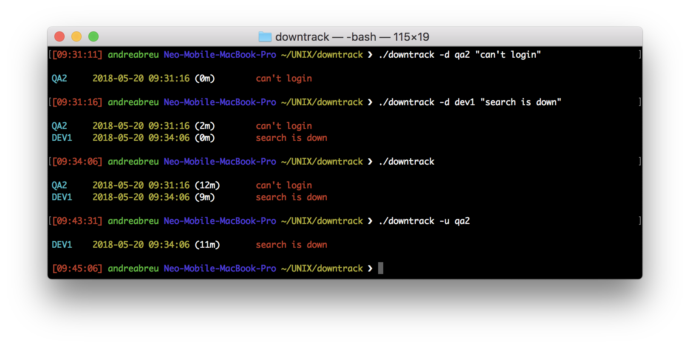

# downtrack

An application to keep track of a down event, e.g. Environments.



Dependencies
------------

* [SQLite3][sqlite3] 

[sqlite3]: https://www.sqlite.org/index.html

Features
--------

* Cross platform (tested on x86, ARM)
* Small code footprint

Tested Environments
-------------------

* Free BSD
* GNU Linux
* MacOSX
* Raspberry Pi

If you have successfully tested this application on others systems or platforms please let me know!

Install
-------

To clone the repository you should have Git installed. Just run:

	$ git clone https://github.com/asabreu/downtrack

To build the application, run `make`.

If build was successful, you should get a `downtrack` binary.

#### Installation of development packages for `sqlite3`

**macOS X with `Homebrew`:**

```
bash
    brew instal sqlite
```

**Debian & Ubuntu Linux:**

```
bash
    sudo apt-get install sqlite3 libsqlite3-dev    
```

Usage
-----

The syntax is quite simple:

```
usage: downtrack [-r | -h] [-d | -u] 'event' <'reason'> ...

without option, display if exists status for down events with since date/time information.

with option:
	-r	Display detailed report.
	-h	Display this usage help.

	-d	Add down event entry.
	-u	Update down event if exists with up state.
```

To-Do
-----

- [x] Display status
- [x] Add down event entry (-d)
- [x] Set up state for existing down event entry (-u)
- [ ] Generate report
